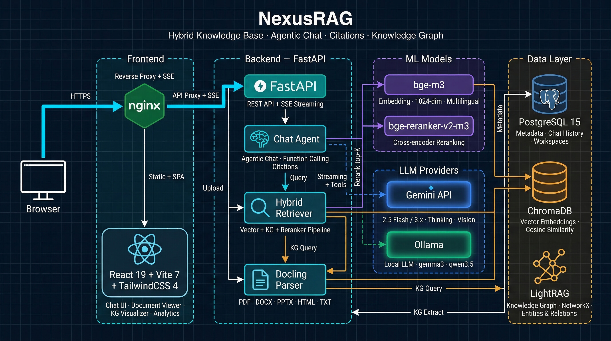

<div align="center">

# NexusRAG

### Hybrid Knowledge Base with Agentic Chat, Citations & Knowledge Graph

[](https://python.org)
[](https://react.dev)
[](https://fastapi.tiangolo.com)
[](https://docker.com)
[](LICENSE)

**Upload documents. Ask questions. Get cited answers.**

NexusRAG combines vector search, knowledge graph, and cross-encoder reranking into one seamless RAG pipeline — powered by Gemini or local Ollama models.

[Features](#features) · [Quick Start](#quick-start) · [Model Recommendations](#multi-provider-llm) · [Tech Stack](#tech-stack)

</div>

---

## Architecture

<div align="center">



</div>

## Showcase

<!-- Add screenshots to /showcase directory -->
<!--
| Chat with Citations | Knowledge Graph |
|:---:|:---:|
|  |  |
| **Document Viewer** | **Analytics Dashboard** |
|  |  |
-->

---

## Features

### Hybrid Retrieval Pipeline

| Stage | Technology | Details |
|---|---|---|
| **Embedding** | BAAI/bge-m3 | 1024-dim multilingual (100+ languages) |
| **Vector Search** | ChromaDB | Cosine similarity, configurable top-N prefetch |
| **Knowledge Graph** | LightRAG | Entity/relationship extraction, multi-hop traversal |
| **Reranking** | BAAI/bge-reranker-v2-m3 | Cross-encoder joint scoring for precision filtering |
| **Generation** | Gemini / Ollama | Agentic streaming chat with function calling |

The pipeline runs all three retrieval stages in parallel — vector over-fetch + KG query simultaneously, then cross-encoder reranking filters to the most relevant chunks.

---

### Citation System

Every answer is grounded in source documents with **4-character citation IDs** (e.g., `[a3z1]`):

- **Inline citations** — Clickable badges embedded directly in the answer text
- **Source cards** — Each citation shows filename, page number, heading path, and relevance score
- **Cross-navigation** — Click a citation to jump to the exact section in the document viewer
- **Image references** — Visual content cited separately as `[IMG-p4f2]` with page tracking
- **Strict grounding** — The LLM is instructed to only cite sources that directly support claims, max 3 per sentence

---

### Visual Document Intelligence

Documents aren't just text — images and tables are first-class citizens in the retrieval pipeline:

**Image Extraction & Captioning**
- Automatic extraction from PDF/DOCX/PPTX via Docling (up to 50 images per document)
- LLM-generated captions (Gemini Vision or Ollama multimodal) describing charts, diagrams, photos
- Captions indexed into ChromaDB — **images become searchable via vector similarity**
- Gallery view with lightbox, lazy loading, and page grouping

**Table Extraction**
- Structured table parsing to Markdown with row/column metadata
- LLM-generated table summaries (purpose, key values, trends)
- Tables with captions indexed as chunks — searchable alongside text

**Document Viewer**
- Full Markdown rendering with LaTeX math, GFM tables, syntax-highlighted code blocks
- Interactive Table of Contents with active section tracking (IntersectionObserver)
- Page dividers extracted from Docling structure
- Scroll-to-heading and scroll-to-image with highlight animation

---

### Knowledge Graph Visualization

Interactive force-directed graph built from extracted entities and relationships:

- **Entity types** — Person, Organization, Product, Location, Event, Technology, Financial Metric, Date, Regulation (configurable)
- **Force simulation** — Repulsion + spring forces + center gravity with real-time physics
- **Pan & zoom** — Mouse drag, scroll wheel (0.3x-3x), keyboard reset
- **Node interaction** — Click to select, hover to highlight connected edges, drag to reposition
- **Entity scaling** — Node radius proportional to connectivity (degree)
- **Query modes** — Naive, Local (multi-hop), Global (summary), Hybrid (default)
- **No extra services** — LightRAG uses file-based storage (NetworkX + NanoVectorDB), zero Docker overhead

---

### Multi-Provider LLM

Switch between cloud and local models with a single environment variable:

#### Gemini (Cloud)

| Model | Best For | Thinking |
|---|---|---|
| `gemini-2.5-flash` | General chat, fast responses | Budget-based (auto) |
| `gemini-3.1-flash-lite` | High throughput, cost-effective | Level-based: minimal / low / medium / high |

Extended thinking is automatically configured — Gemini 2.5 uses `thinking_budget_tokens`, Gemini 3.x uses `thinking_level`.

#### Ollama (Local / Self-hosted)

| Model | Parameters | Recommendation |
|---|---|---|
| `gemma3:12b` | 12B | Best balance of quality and speed. **Recommended default** |
| `qwen3.5:9b` | 9B | Good multilingual support, solid tool calling |
| `qwen3.5:4b` | 4B | Lightweight, works on 8GB RAM. May miss some tool calls |

> **Tip**: For Knowledge Graph extraction, larger models (12B+) produce significantly better entity/relationship quality. Smaller models (4B) may extract zero entities on complex documents.

**Provider switching** — Comment/uncomment blocks in `.env`:

```bash
# Cloud (Gemini)
LLM_PROVIDER=gemini
GOOGLE_AI_API_KEY=your-key

# Local (Ollama) — uncomment to switch
# LLM_PROVIDER=ollama
# OLLAMA_MODEL=gemma3:12b
```

---

### Agentic Streaming Chat

The chat system uses a semi-agentic architecture with real-time SSE streaming:

- **Agent steps** — Visual timeline: Analyzing → Retrieving → Generating → Done (with live timers)
- **Extended thinking** — Gemini/Ollama reasoning displayed in a collapsible panel
- **Function calling** — Native (Gemini) or prompt-based (Ollama) `search_documents` tool
- **Force-search mode** — Pre-retrieval before LLM generation for guaranteed grounded answers
- **Heartbeat** — 15s SSE keepalive prevents TCP timeout on slow responses
- **Fallback** — If Ollama produces empty output, auto-triggers search + retry
- **Chat history** — Persistent per workspace with message ratings (thumbs up/down)

---

### UI / UX

**Theme & Layout**
- Dark / Light mode with smooth transition, persisted preference
- Collapsible sidebar with workspace navigation (icon-only mode at narrow width)
- Responsive grid layouts — mobile to desktop

**Chat Interface**
- Streaming token rendering with memoized paragraph blocks (only active block re-renders)
- Inline citation badges with hover tooltips (source file, page, heading path, relevance %)
- Agent step timeline with spinner animations and elapsed timers
- Thinking panel — scrollable, auto-follow, collapsible after completion
- Code blocks with syntax highlighting (Python, JS, SQL, etc.) and one-click copy

**Document Management**
- Drag-and-drop upload (PDF, DOCX, PPTX, TXT, MD — up to 50MB)
- Status badges with shimmer animation during processing
- Per-document chips: pages, chunks, images, tables, file size, processing time

**Search**
- 4 query modes: Hybrid, Vector, Local KG, Global KG
- Adjustable result count (1-20) with slider + direct input
- Document scope filtering (multi-select)
- Relevance score bars with color coding (green / amber / red)

**Analytics Dashboard**
- Stat cards: documents, indexed, chunks, images, entities, relationships
- Entity type distribution bar with animated widths
- Top entities ranked by connectivity
- Per-document chunk breakdown chart

**Micro-interactions**
- Framer Motion animations throughout (staggered entrances, layout transitions)
- Loading skeletons, toast notifications, empty state illustrations
- Keyboard shortcuts: `/` to focus search, `Enter` to send, `Escape` to cancel

---

### Workspace System

- Multiple isolated knowledge bases, each with its own documents, ChromaDB collection, and KG
- Custom system prompt per workspace (override default Q&A behavior)
- Independent chat history with message persistence and ratings

---

## Tech Stack

### Backend

| Technology | Purpose |
|---|---|
| **FastAPI** | Async web framework with SSE streaming |
| **SQLAlchemy 2.0** | Async ORM with PostgreSQL (asyncpg) |
| **ChromaDB** | Vector store — cosine similarity, per-workspace collections |
| **LightRAG** | Knowledge graph — entity extraction, multi-hop queries |
| **Docling** | Document parsing — PDF, DOCX, PPTX, HTML with structural extraction |
| **sentence-transformers** | BAAI/bge-m3 embeddings + BAAI/bge-reranker-v2-m3 reranking |
| **google-genai** | Gemini API — chat, vision, function calling, extended thinking |
| **ollama** | Local LLM — tool calling via prompt tags, multimodal support |

### Frontend

| Technology | Purpose |
|---|---|
| **React 19** + **TypeScript 5.9** | UI framework with strict typing |
| **Vite 7** | Dev server and production bundler |
| **TailwindCSS 4** | Utility-first styling with dark / light theme |
| **Zustand 5** | Lightweight state management |
| **React Query 5** | Async data fetching, caching, and mutations |
| **Framer Motion 12** | Layout animations, transitions, staggered entrances |
| **react-markdown** + **KaTeX** | Rich markdown with LaTeX math rendering |
| **Lucide React** | Icon library |

### Infrastructure

| Technology | Purpose |
|---|---|
| **PostgreSQL 15** | Document metadata, chat history, workspace config |
| **ChromaDB** | Vector embeddings (HTTP client, containerized) |
| **LightRAG** | File-based KG (NetworkX + NanoVectorDB — no extra services) |
| **Docker Compose** | Full-stack deployment (4 containers) |
| **nginx** | Production frontend serving + API/SSE reverse proxy |

---

## Quick Start

### Option A: Docker (Full Stack)

```bash
git clone https://github.com/LeDat98/NexusRAG.git
cd NexusRAG
cp .env.example .env
# Edit .env — set GOOGLE_AI_API_KEY (or switch to Ollama)
docker compose up -d
```

First build takes ~5-10 minutes (downloads ML models ~2.5GB). Open http://localhost:5174

### Option B: Local Development

```bash
git clone https://github.com/LeDat98/NexusRAG.git
cd NexusRAG
./setup.sh
```

The script checks prerequisites, creates venv, installs deps, starts PostgreSQL + ChromaDB, and optionally downloads ML models.

```bash
# Terminal 1 — Backend (port 8080)
./run_bk.sh

# Terminal 2 — Frontend (port 5174)
./run_fe.sh
```

Open http://localhost:5174

### System Requirements

| Resource | Minimum | Recommended |
|---|---|---|
| RAM | 4 GB | 8 GB+ |
| Disk | 5 GB | 10 GB+ |
| Python | 3.10+ | 3.11+ |
| Node.js | 18+ | 22 LTS |
| Docker | 20+ | Latest |

---

## Configuration

Copy `.env.example` and configure:

```bash
cp .env.example .env
```

### Required

| Variable | Description |
|---|---|
| `GOOGLE_AI_API_KEY` | Google AI API key (required for Gemini provider) |

### LLM

| Variable | Default | Description |
|---|---|---|
| `LLM_PROVIDER` | `gemini` | `gemini` or `ollama` |
| `LLM_MODEL_FAST` | `gemini-2.5-flash` | Model for chat and KG extraction |
| `LLM_THINKING_LEVEL` | `medium` | Gemini 3.x thinking: `minimal` / `low` / `medium` / `high` |
| `LLM_MAX_OUTPUT_TOKENS` | `8192` | Max output tokens (includes thinking) |
| `OLLAMA_HOST` | `http://localhost:11434` | Ollama server URL |
| `OLLAMA_MODEL` | `gemma3:12b` | Ollama model name |

### RAG Pipeline

| Variable | Default | Description |
|---|---|---|
| `NEXUSRAG_EMBEDDING_MODEL` | `BAAI/bge-m3` | Embedding model (1024-dim) |
| `NEXUSRAG_RERANKER_MODEL` | `BAAI/bge-reranker-v2-m3` | Cross-encoder reranker |
| `NEXUSRAG_VECTOR_PREFETCH` | `20` | Candidates before reranking |
| `NEXUSRAG_RERANKER_TOP_K` | `8` | Final results after reranking |
| `NEXUSRAG_ENABLE_KG` | `true` | Enable knowledge graph extraction |
| `NEXUSRAG_ENABLE_IMAGE_EXTRACTION` | `true` | Extract images from documents |
| `NEXUSRAG_ENABLE_IMAGE_CAPTIONING` | `true` | LLM-caption images for search |
| `NEXUSRAG_KG_LANGUAGE` | `Vietnamese` | KG extraction language |

---

## Architecture

```
                         ┌─────────────────────────────────────┐
                         │         Document Upload              │
                         │   (PDF / DOCX / PPTX / HTML / TXT)  │
                         └──────────────┬──────────────────────┘
                                        │
                         ┌──────────────▼──────────────────────┐
                         │          Docling Parser              │
                         │   → Markdown + Images + Tables       │
                         └──────────────┬──────────────────────┘
                                        │
               ┌────────────────────────┼────────────────────────┐
               │                        │                        │
    ┌──────────▼──────────┐  ┌──────────▼──────────┐  ┌─────────▼──────────┐
    │   Text Chunking      │  │  Image Extraction   │  │  Table Extraction  │
    │   (512 chars,        │  │  + LLM Captioning   │  │  → Markdown +      │
    │    overlap)           │  │  → Searchable       │  │    LLM Summary     │
    └──────────┬───────────┘  └──────────────────────┘  └────────────────────┘
               │
        ┌──────┼──────────────────┐
        │                         │
  ┌─────▼──────────┐    ┌────────▼─────────────┐
  │   ChromaDB     │    │     LightRAG         │
  │   bge-m3       │    │   Entity + Relation  │
  │   (1024-dim)   │    │   Extraction         │
  └────────────────┘    └──────────────────────┘

              Query Flow
              ─────────
       ┌──────────────────────┐
       │    User Question      │
       └──────────┬───────────┘
                  │
        ┌─────────┼──────────────┐
        │ (parallel)             │
  ┌─────▼───────────┐  ┌────────▼──────────────┐
  │ Vector Search    │  │  KG Query             │
  │ (prefetch top-N) │  │  (hybrid: local +     │
  │                  │  │   global)              │
  └────────┬─────────┘  └──────────────────────┘
           │
  ┌────────▼──────────────────┐
  │  Cross-encoder Reranking   │
  │  (bge-reranker-v2-m3)     │
  │  → top-K results           │
  └────────┬──────────────────┘
           │
  ┌────────▼──────────────────┐
  │  Agentic LLM Generation   │
  │  (Gemini / Ollama)        │
  │  → Streaming answer with   │
  │    [citation IDs]          │
  └───────────────────────────┘
```

---

## API

All endpoints prefixed with `/api/v1`. Interactive docs at http://localhost:8080/docs

<details>
<summary><b>Workspaces</b></summary>

| Method | Endpoint | Description |
|---|---|---|
| `GET` | `/workspaces` | List all workspaces |
| `POST` | `/workspaces` | Create workspace |
| `PUT` | `/workspaces/{id}` | Update workspace |
| `DELETE` | `/workspaces/{id}` | Delete workspace + all data |

</details>

<details>
<summary><b>Documents</b></summary>

| Method | Endpoint | Description |
|---|---|---|
| `POST` | `/documents/upload/{workspace_id}` | Upload file |
| `GET` | `/documents/{id}/markdown` | Get parsed content |
| `GET` | `/documents/{id}/images` | List extracted images |
| `DELETE` | `/documents/{id}` | Delete document |

</details>

<details>
<summary><b>RAG — Search, Chat, Analytics</b></summary>

| Method | Endpoint | Description |
|---|---|---|
| `POST` | `/rag/query/{workspace_id}` | Hybrid search |
| `POST` | `/rag/chat/{workspace_id}/stream` | Agentic streaming chat (SSE) |
| `GET` | `/rag/chat/{workspace_id}/history` | Chat history |
| `POST` | `/rag/process/{document_id}` | Process document |
| `GET` | `/rag/graph/{workspace_id}` | Knowledge graph data |
| `GET` | `/rag/analytics/{workspace_id}` | Full analytics |

</details>

---

<div align="center">

MIT License &copy; 2026 Le Duc Dat

</div>
